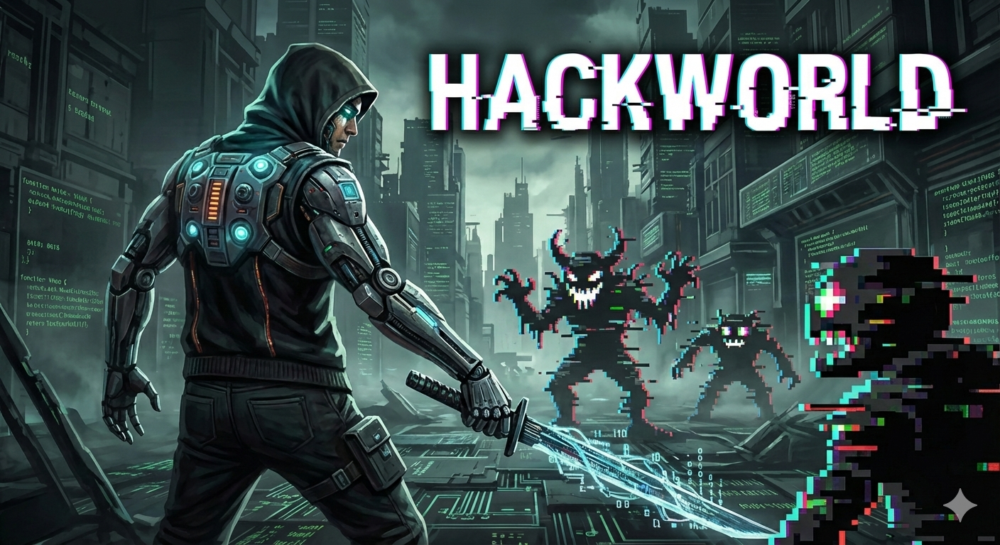

# Hackworld



A 3D web game developed with TypeScript, Three.js, and Cannon-es.

## Story

Ometec corporation's systems are self-destructing due to a catastrophic malware infection. When a technician interfaced with the servers to fix the issue, his neural patterns manifested within the digital realm as the player character. Now you must navigate through multiple corrupted system layers, guided by the Mainframe AI, and eliminate the spreading malware before total system collapse.

## Features

- Hack and slash gameplay with quest progression
- **Hub-based game world** - Multiple stages progressively unlocked through gameplay
- **Five-stage campaign progression** - Clear increasingly difficult sectors: Network Matrix → Packet Forge → Cipher Null → Security Core → Kernel Terminus
- **Procedurally generated dungeons** - Obstacle layouts and enemy placements are randomised every time a dungeon stage is entered, keeping exploration fresh
- **Stage minimap system** - A 240x180 minimap appears in the top-right corner; in dungeon stages it unlocks after picking up the **Grid Tracer** item from one loot room, while the Lobby minimap is always visible
- **Level system** - Gain EXP from defeating enemies to level up and increase your stats
- **Tech Points** - Gain tech points by using a specific weapon or skill to unlock higher level items and skill variants
- **Loot Mechanics** - Inventory system with randomized looting mechanics
- **Card collectibles** - Collectible cards that are dropped by enemies in packs of 4 and can be opened in the lobby to unlock unique bonuses
- **Save/Load system** - Save your game progress to a file or load a previously saved game through the Save Manager NPC in the lobby. The game also automatically saves in the local browser storage.

## Tech Stack

- **Language**: TypeScript
- **Rendering**: Three.js
- **Physics**: Cannon-es
- **Build Tool**: Vite
- **Hosting**: GitHub Pages

## Live Demo

Play the game at: [https://samtun.github.io/hackworld/](https://samtun.github.io/hackworld/)

## Inspiration & Goal

- The game is a fan project trying to recreate the esthetic and reuse some of the mechanics of the 2005 game Digimon World 4
- It attempts to improve some of the biggest issues the original game had:
   - The hub is a single area without loading screens
   - Loading screens in general are less common and finish quicker
   - New equipment can be equipped at any time. No need to return to the hub
   - The combat feels a bit more dynamic while keeping the original feel in many areas

## Installation & Start

1. Install dependencies:
   ```bash
   npm install
   ```

2. Start development server:
   ```bash
   npm run dev
   ```

3. Build for production:
   ```bash
   npm run build
   ```

## Gameplay

### Controls

The game is fully playable with keyboard, controller (tested with XBox controller), and mobile touch controls.

#### Keyboard & Controller
- **WASD / Arrow Keys / LStick**: Move player
- **Space / A**: Jump
- **K / X**: Attack (tap for normal attack, hold for 1s then release for charged dash attack)
- **L / B**: Block (absorbs incoming damage for 0.5s, immobilises the player briefly)
- **Q + Space / L1 + A**: Laser Beam skill (ranged attack, 30m range, 20 damage, 10s cooldown)
- **Q + Escape / L1 + B**: Healing skill (heal 40 HP, 5s cooldown)
- **Q + K / L1 + X**: Area Attack skill (5m circular area, 18 damage, 10s cooldown)
- **I / Select**: Toggle inventory
- **Enter / A**: Interact and select in menus
- **ESC / B**: Close menus / Block (B)

#### Mobile Touch Controls
Mobile devices (phones and tablets) automatically display on-screen touch controls.

## Development

### Sound Editor

The project includes a standalone sound effect and music editor that lets you compose synthetic audio visually using the Web Audio API.

```bash
npm run dev:sound-editor
```

This starts the editor on **http://localhost:5174** (separate from the main game server).

#### Features
- **SFX Composer tab**: Add any number of Tone and Noise layers, tune every parameter (frequency, duration, waveform type, gain, delay, glide-to), preview the sound live in your browser, then copy the generated snippet.
  - *Raw Calls* mode outputs `this.playTone(...)` / `this.playNoise(...)` calls ready to drop into a `play*()` method in `src/AudioManager.ts`.
  - *SFX_PARAMS Entry* mode outputs a typed object suitable for insertion into the `SFX_PARAMS` constant block in `src/AudioManager.ts`.
- **Music Profile tab**: Enter pulse and harmony phrases (comma-separated Hz values), preview the looping phrase, then copy the `createStageMusicProfile(...)` call to insert into `STAGE_MUSIC` in `src/AudioManager.ts`.

#### Tuning sounds without the editor

All sound-effect parameters live in the exported `SFX_PARAMS` constant near the top of `src/AudioManager.ts`, grouped by sound name.  Each entry is a plain object with clearly-named numeric fields (`freq`, `dur`, `gain`, `lowpass`, `highpass`, etc.).  Edit any number there and the corresponding `play*()` method will pick up the changes automatically — no rebuild needed in `npm run dev`.

### Testing fresh or saved game

By default the latest saved game state will be restored automatically on game start.

To prevent this use the argument `fresh` on `npm run dev` to always start with a fresh game, avoiding the automatic save game loading.

```
npm run dev:fresh
```

### Commit Conventions

This project uses [Conventional Commits](https://www.conventionalcommits.org/) to ensure consistent commit messages and enable automated versioning.

#### Commit Message Format
All commit messages must follow this format:
```
type: description
```

Common types:
- **feat**: A new feature (triggers minor version bump)
- **fix**: A bug fix (triggers patch version bump)
- **docs**: Documentation changes
- **style**: Code style changes (formatting, missing semicolons, etc.)
- **refactor**: Code changes that neither fix a bug nor add a feature
- **perf**: Performance improvements
- **test**: Adding or updating tests
- **chore**: Changes to build process or auxiliary tools

Examples:
- `feat: add inventory sorting feature`
- `fix: resolve player collision bug`
- `docs: update installation instructions`

#### Local Enforcement
Commit messages are validated locally via Husky hooks. Invalid commits will be rejected before they reach the repository.

### Debug Mode
The game includes a comprehensive debug mode for development and testing.
- **Availability**: Development builds only (`npm run dev`)
- **Toggle**: Press **F8** to enable/disable debug mode

#### Debug Features
When debug mode is enabled (F8), you get access to:

1. **Physics Colliders Visualization**: Red wireframe boxes show all physics collision boundaries
2. **Debug Value Editor**: A powerful overlay for live editing and testing
   - **Player Stats Editor**: Modify HP, TP, Strength, Defense, Speed, Level, X-Data, Money, and Quest Progress in real-time
   - **Add Items**: Add any weapons, cores and chips to the player inventory
   - **Collapsible UI**: Click the arrow button (▼/▲) to expand or collapse the editor panel
3. **GameTest stage**: A stage filled with various gameplay elements to test the game with

## Deployment

Both production and PR preview deployments use the `gh-pages` branch to enable subdirectory-based previews without conflicts.

### CI/CD Workflows

#### Commit Linting
Pull requests are automatically checked to ensure all commits follow the conventional commit format. This ensures consistent commit history and enables automated releases.

#### Automated Releases
When changes are merged to `main`:
1. **semantic-release** analyzes commits since the last release
2. Determines the next version number (major, minor, or patch)
3. Updates `package.json` and `package-lock.json`
4. Generates/updates `CHANGELOG.md`
5. Creates a Git tag and GitHub Release

### Production Deployment
The game is automatically deployed to GitHub Pages when changes are pushed to the `main` branch. The deployment workflow:
- Builds the project using Vite with base path `/hackworld/`
- Deploys to the root of the `gh-pages` branch
- Accessible at [https://samtun.github.io/hackworld/](https://samtun.github.io/hackworld/)

### PR Preview Deployments
Pull requests that are marked as "ready for review" automatically get preview deployments:
- Each PR is built with a unique base path (e.g., `/hackworld/pr-123/`)
- Preview is deployed to a subdirectory in the `gh-pages` branch
- A comment with the preview URL is automatically added to the PR
- Preview updates automatically when new commits are pushed to the PR
- **Preview is automatically deleted** when the PR is closed or merged
- Preview URL format: `https://samtun.github.io/hackworld/pr-{number}/`
